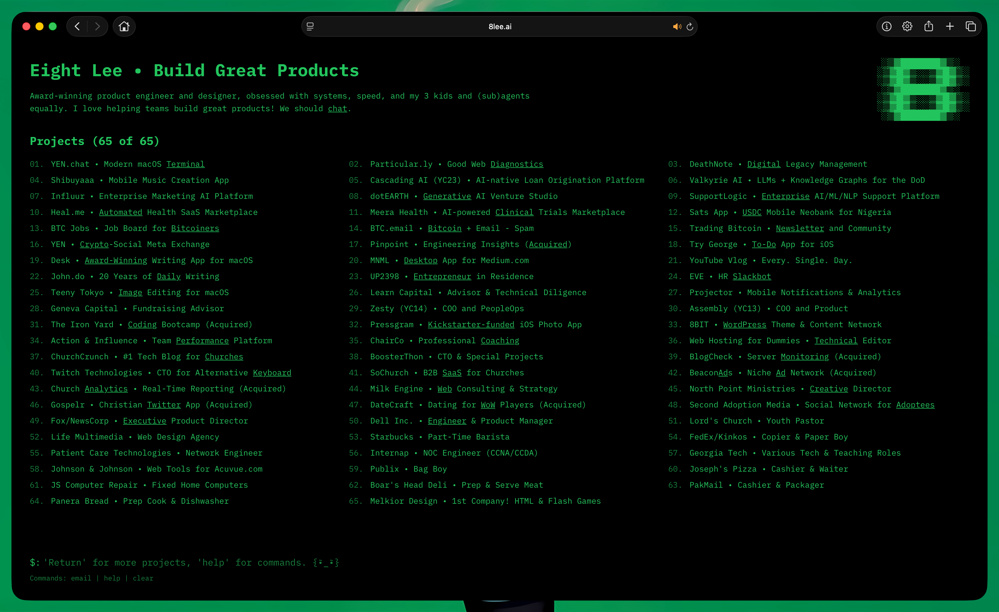
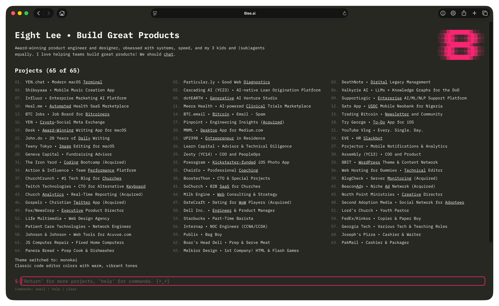
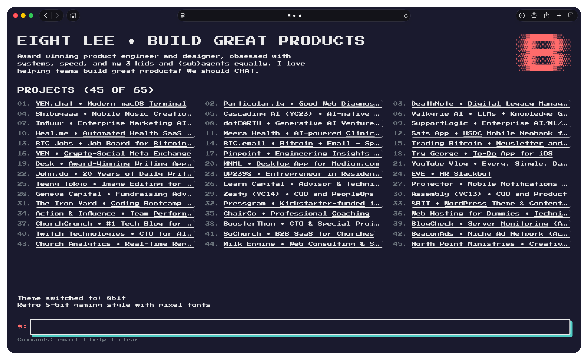
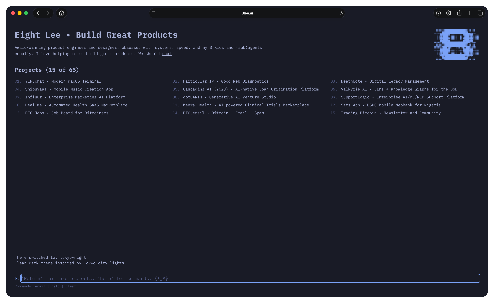
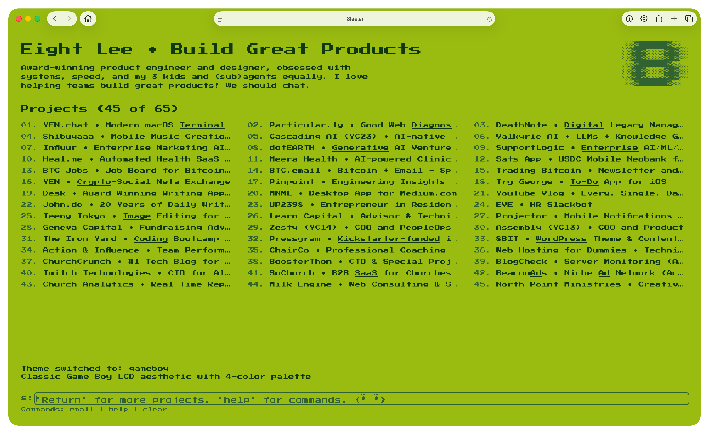
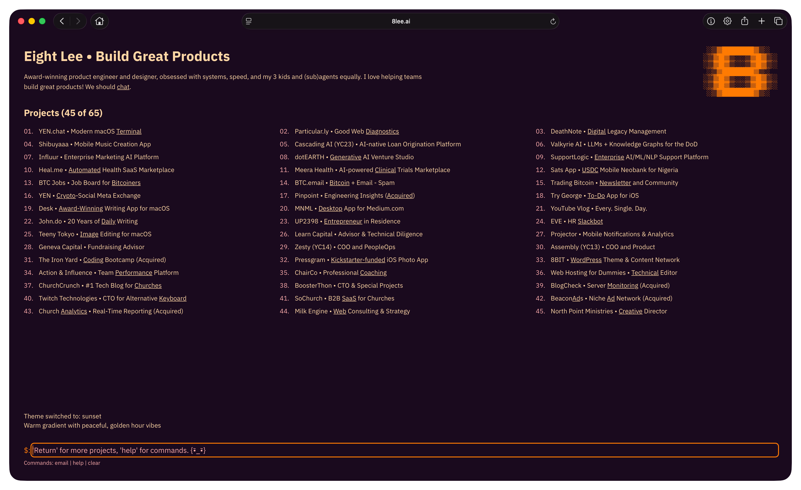
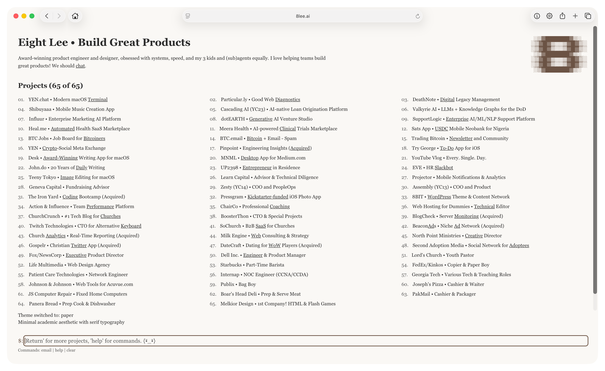

<p align="center">
  
</p>

<h1 align="center">Retro Terminal Portfolio</h1>

<p align="center">
  <strong>A nostalgic DOS-style terminal experience for the modern web.</strong><br/>
  Built for developers, designers, and creators who want a portfolio that stands out.
</p>

<p align="center">
  <a href="https://8lee.ai"></a>
  <a href="#quick-start"></a>
</p>

<p align="center">
  
  
  
  
  
</p>

<p align="center">
  <sub>Developed with <a href="https://yen.chat">YEN</a> - the personal terminal experience</sub>
</p>

---

## Why This Exists

Most portfolios look the same. This one doesn't.

Visitors interact with your work through a **command-line interface** - typing commands, exploring projects, and discovering your story like they're hacking into a retro mainframe. It's memorable, it's fun, and it showcases your personality.

### What You Get

- **66+ project slots** - Showcase your entire body of work
- **23 color themes** - From classic green phosphor to synthwave pink
- **Full keyboard navigation** - Arrow keys, tab completion, shortcuts
- **WCAG 2.1 AA accessible** - Screen reader friendly
- **Mobile responsive** - Works everywhere
- **Blazing fast** - Static generation, zero client-side data fetching

---

## Quick Start

**Requires [Bun](https://bun.sh) v1.3.9+**

```bash
# Clone the repo
git clone https://github.com/8bittts/8leeai.git
cd 8leeai

# Install dependencies
bun install

# Start development server
bun run dev
```

Open [http://localhost:1333](http://localhost:1333) and start customizing.

---

## Make It Yours

### 1. Update Your Data

Edit `lib/data.ts` to add your projects, education, and experience:

```typescript
export const projects: ReadonlyArray<PortfolioItem> = [
  {
    id: "my-project",
    name: "My Project - Short Description",
    url: "https://myproject.com",
    linkWord: "Project",  // clickable word in the listing
  },
  // Add as many projects as you want
];
```

### 2. Customize Themes

23 themes included in `lib/themes/`. Create your own or modify existing ones:

| Theme | Vibe |
|-------|------|
| `default` | Classic green terminal |
| `amber` | Warm vintage CRT |
| `synthwave` | 80s neon purple/pink |
| `nord` | Cool arctic blues |
| `dracula` | Dark with purple accents |
| `solarized` | Easy on the eyes |

Switch themes with the `theme` command or `theme [name]`.

### 3. Deploy

```bash
# Build for production
bun run build

# Deploy to Vercel (recommended)
vercel --prod
```

---

## Terminal Commands

Your visitors can use these commands:

| Command | What It Does |
|---------|--------------|
| `1-66` | Open project by number |
| `67-71` | View education |
| `72-77` | See volunteer work |
| `help` | Show all commands |
| `theme` | List available themes |
| `theme [name]` | Switch to a theme |
| `random` | Surprise me with a project |
| `email` | Get contact info |
| `clear` | Reset the terminal |
| `Ctrl+L` | Quick clear shortcut |

---

## Tech Stack

| Layer | Technology |
|-------|------------|
| Framework | Next.js 16 (App Router + Turbopack) |
| UI | React 19 |
| Styling | Tailwind CSS v4 |
| Language | TypeScript 5.9 (strict mode) |
| Runtime | Bun 1.3.9 |
| Linting | Biome |
| Deployment | Vercel |

---

## Project Structure

```
app/           Next.js App Router pages and layouts
components/    Reusable UI components
lib/
  data.ts      Your portfolio content
  themes/      23 color theme definitions
  commands.ts  Terminal command logic
  utils.ts     Helper functions
public/        Static assets
```

---

## Theme Examples

<p align="center">
  
</p>

<p align="center">
  
</p>

<p align="center">
  
</p>

<p align="center">
  
</p>

<p align="center">
  
</p>

<p align="center">
  
</p>

---

## Contributing

This is a personal portfolio template. Fork it, make it yours. If you build something cool, I'd love to see it.

For development workflows and coding conventions, check the project's internal docs.

## Claude Code Integration

This project uses Claude Code with global rules from `~/.claude/CLAUDE.md`. Project-specific rules are in `CLAUDE.md`.

Global configuration backup (for recovery on new computers) is maintained in the [deathnote project](https://github.com/8bittts/deathnote) at `claude-global.md`.

---

<p align="center">
  
</p>

<h3 align="center">Built with YEN</h3>

<p align="center">
  <a href="https://yen.chat">YEN</a> is a personal terminal experience that makes command-line work beautiful.<br/>
  Fast, customizable, and designed for developers who live in the terminal.<br/>
  <br/>
  <a href="https://yen.chat"></a>
</p>

---

<p align="center">
  <strong>MIT License</strong><br/>
  <sub>Use it, modify it, ship it.</sub>
</p>
