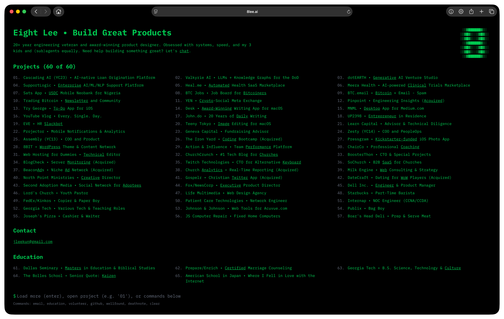

# Retro Terminal Homepage - Focused on Privacy

An original, retro terminal-style portfolio experience built with modern web technologies.

**FYI**: The codebase is configured for **"ultra private" mode** with aggressive anti-crawling settings:
- `robots.txt` blocks all search engines and crawlers
- Security headers prevent indexing and archiving
- Metadata includes `noindex, nofollow` directives

**Before using this template, please review and update:**
- `/public/robots.txt` - Remove restrictive crawler blocking if you want SEO
- `/middleware.ts` - Adjust security headers and CORS settings for your domain
- `/app/layout.tsx` - Update metadata, robots settings, and OpenGraph data
- `/lib/data.ts` - Replace with your own portfolio content

The current settings are designed for a completely private portfolio that won't appear in search results.

[](https://github.com/8bittts/8leeai/releases)
[](https://nextjs.org)
[](https://react.dev)
[](https://tailwindcss.com)

## Live Demo

Take it for a test-drive at [www.8lee.ai](https://8lee.ai).



## Features

- **Authentic Terminal Experience**: Complete boot sequence animation and command-line interface
- **Interactive Commands**: Navigate through 60+ projects, education, and volunteer experience
- **Typewriter Effects**: Smooth text animations with nostalgic terminal feel
- **Custom 404 Page**: Mario-themed error page with typewriter effect that returns to home on interaction
- **Comprehensive Portfolio**: Professional work and achievements spanning multiple decades
- **Production Security**: CSP headers, CORS restrictions, and secure external link handling
- **Responsive Design**: Fully responsive terminal interface for all devices
- **Zero Bloat**: Pure Tailwind utilities, minimal dependencies, optimal performance
- **Audio Integration**: Subtle interaction sound effects at 2% volume on first user interaction
- **PWA Ready**: Includes favicon set and Apple Touch icons for mobile home screen installation
- **WCAG 2.1 AA Compliant**: Full accessibility with semantic HTML, ARIA live regions, keyboard navigation, focus indicators, and reduced motion support

## Quick Start

### Prerequisites

- [Bun](https://bun.sh) v1.2.23 or higher
- Node.js 18+ (for compatibility)

### Installation

```bash
# Clone the repository
git clone https://github.com/8bittts/8leeai.git
cd 8leeai

# Install dependencies
bun install

# Run development server
bun run dev
```

Open [http://localhost:1333](http://localhost:1333) to view the terminal.


## Available Commands

Once the terminal loads, you can use these commands:

- `enter` - Show more projects (pagination is 15 by default)
- `1-60` - Open specific project by number (e.g., `42`)
- `61-65` - Open education item by number
- `66-71` - Open volunteer experience by number
- `email` - Display contact email info
- `github` - Open this GitHub project
- `wellfound` - Open Wellfound profile
- `education` - Show education background
- `volunteer` - Display volunteer experience
- `deathnote` - Open deathnote.ai website
- `clear` - Reset terminal display

## Development

### Recommended Terminal Setup

For optimal development experience on macOS, use [Ghostty](https://ghostty.org) with the custom 8LEE Terminal Theme. Configuration details available in `ghostty.md`.

```bash
# Development with Turbopack
bun run dev

# Build for production
bun run build

# Start production server
bun run start

# Lint and format code
bun run check

# Clean all caches
bun run clean
```

## Tech Stack

- **Framework**: [Next.js 15.5.4](https://nextjs.org) with App Router & Turbopack
- **UI**: [React 19.2.0](https://react.dev) with modern hooks
- **Styling**: [Tailwind CSS v4.1.14](https://tailwindcss.com) pure utilities
- **Language**: [TypeScript 5.9.3](https://www.typescriptlang.org) with strict configuration
- **Runtime**: [Bun](https://bun.sh) for optimal performance
- **Code Quality**: [Biome 2.2.5](https://biomejs.dev) for linting and formatting
- **Security**: Production-grade middleware with CSP and CORS
- **Analytics**: [Vercel Analytics](https://vercel.com/analytics) and [Speed Insights](https://vercel.com/docs/speed-insights)
- **Deployment**: [Vercel](https://vercel.com)

## Project Structure

```
8leeai/
├── app/                 # Next.js app router
│   ├── layout.tsx       # Root layout with metadata
│   ├── page.tsx         # Main terminal page
│   └── not-found.tsx    # Custom 404 page
├── components/          # React components
│   ├── boot-sequence.tsx
│   ├── command-prompt.tsx
│   ├── cv-content.tsx
│   └── terminal-container.tsx
├── hooks/              # Custom React hooks
├── lib/                # Utilities and data
├── public/             # Static assets
│   ├── mario.jpg       # 404 background
│   └── 8-social.jpeg   # Social share image
└── middleware.ts       # Security headers
```

## Code Quality

All code includes concise, useful comments following these guidelines:
- **Component-level**: JSDoc describing purpose and behavior
- **Inline comments**: Explain complex logic, state management, and non-obvious patterns
- **No redundant comments**: Code clarity over stating the obvious

## Security

Production-ready security implementation:
- **Content Security Policy**: Strict CSP with minimal external allowlist
- **CORS**: Restrictive cross-origin policy locked to 8lee.ai
- **HSTS**: Strict transport security with preload
- **External Links**: Secure utility prevents window.opener vulnerabilities
- **Anti-Crawling**: Comprehensive robot blocking configuration
- **Headers**: XSS protection, frame options, content type options

## Version History

v1.0 - September 30, 2025:
- **Production Release**: Terminal interface with authentic boot sequence
- **Interactive Commands**: Full command system with 60+ projects
- **Security Hardened**: Production-grade middleware and secure link handling
- **Performance Optimized**: Minimal dependencies, Turbopack, zero custom CSS
- **Comprehensive Data**: Complete portfolio with projects, education, and volunteer experience
- **Audio Integration**: Subtle sound effects for enhanced immersion
- **Full Accessibility**: WCAG 2.1 AA compliant with semantic HTML, ARIA support, and keyboard navigation

## Contributing

This is a personal portfolio project. Feel free to make suggestions!

## Contact

For inquiries, use the `email` command in the terminal on [8lee.ai](https://8lee.ai), [@8BIT](https://x.com/8BIT) on X, and check out [DeathNote](https://deathnote.ai).
## License

MIT and all that good jazz.
